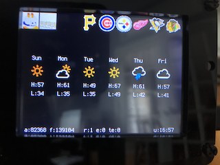

pyGlancePortal
==============

## Introduction
pyGlancePortal provides a quick way to see upcoming weather, if a sports team is playing, and if a channel is streaming on Twitch or Mixer.



## Prerequisites
* [Adafruit PyPortal](https://www.adafruit.com/product/4116)
* PyPortal updated to [5.2.0 or higher](https://circuitpython.org/board/pyportal/)
* CircuitPython bundle updated to [5.x or higher](https://circuitpython.org/libraries)

## External APIs
pyGlancePortal uses several external APIs, some of which require developer accounts:
* [Adafruit IO](https://io.adafruit.com/)
* [Dark Sky](https://darksky.net/dev)
* [Twitch](https://dev.twitch.tv/)
* [Mixer](https://mixerdev.azurewebsites.net/)
* ESPN

## Icons
All icons must be 32x32 BMP format and located in the `icons` directory tree.

```bash
├── icons
    ├── sports  ## team icons are <teamabbreviation>.bmp (e.g. pit.bmp)
    │   ├── mlb
    │   ├── mls
    │   ├── nfl
    │   ├── nhl
    │   ├── nwsl
    │   └── prem
    ├── streamers  ## streamer icons are <handle>.bmp
    └── weather  ## weather icon naming must match weather statuses coming from Dark Sky
        ├── clear-day.bmp
        ├── clear-night.bmp
        ├── cloudy.bmp
        ├── fog.bmp
        ├── hail.bmp
        ├── partly-cloudy-day.bmp
        ├── partly-cloudy-night.bmp
        ├── rain.bmp
        ├── sleet.bmp
        ├── snow.bmp
        ├── thunderstorm.bmp
        ├── unknown.bmp
        └── wind.bmp
```
[Weather Underground icons](https://github.com/manifestinteractive/weather-underground-icons) are a nice option.

ImageMagick commands are handy for resizing/converting.
```bash
convert -scale 45% image.png image-scaled.png
mogrify -format bmp image-scaled.png
```

## Usage

### Example
```py
import time
from pyglanceportal import PyGlancePortal

pyportal = PyGlancePortal(debug=True)

while True:
    pyportal.build_display()
    time.sleep(300)
```

## Roadmap
* This project uses the Dark Sky APIs, and after Apple's acquisition [will no longer be available after July 1, 2021](https://blog.darksky.net/dark-sky-has-a-new-home/). Thus weather functionality will require an alternative API.
* The Twitch API will [require an OAuth token by April 30, 2020](https://discuss.dev.twitch.tv/t/requiring-oauth-for-helix-twitch-api-endpoints/23916), which necessitates an update.

## Credits
ESPN doesn't have a developer API, so this was inspired by the works of [@andr3w321](https://github.com/andr3w321) on [espn_scraper](https://github.com/andr3w321/espn_scraper) and [@akeaswaran](https://github.com/akeaswaran)'s [documentation](https://gist.github.com/akeaswaran/b48b02f1c94f873c6655e7129910fc3b).